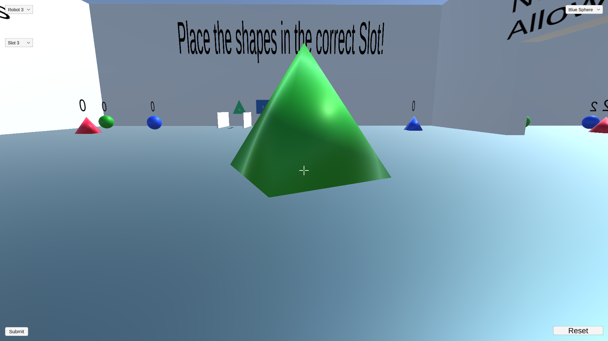
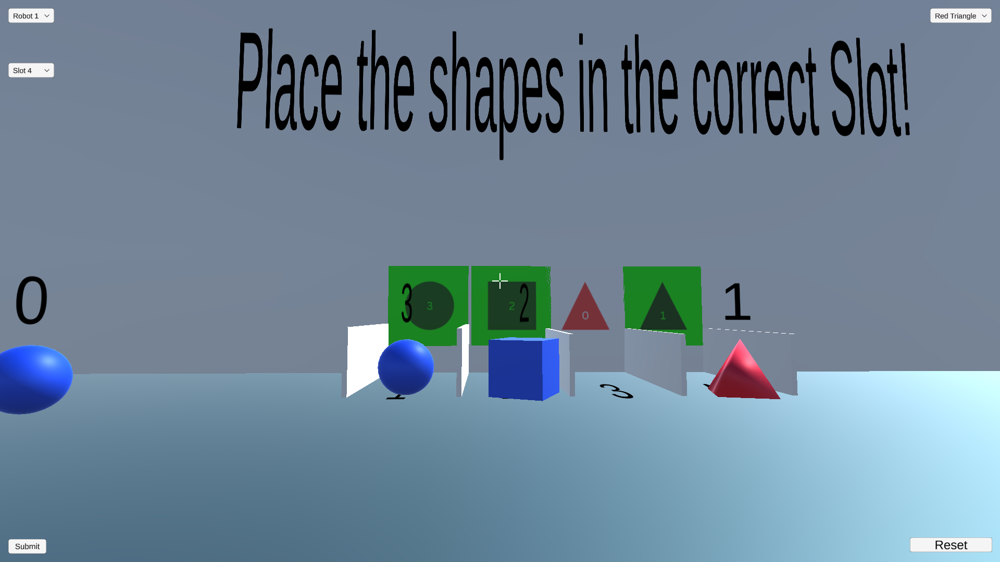

# Voice vs Controller Robot Control Study
A Unity-based simulation comparing voice-activated and controller-based robot control methods in pick-and-place tasks.

## Overview
This project compares the efficiency of voice commands versus mechanical controls for robotic manipulation. Built in Unity, it provides a first-person environment where users can control robots using either traditional controls or voice commands.

## Features
### Manual Control Mode

- First-person perspective control
- WASD movement + mouse look
- Object highlighting and selection
- Direct interaction with robots and objects

### Robot Command Interface

- Dropdown selection for robots (1-3)
- Shape and color selection
- Slot designation
- Visual feedback of robot actions

### Voice Control System

- Natural voice command recognition
- Simple recording interface
- Real-time command processing
- Command structure: "Robot [X], place the [color][shape] in slot [Y]"

## Getting Started
### Installation
1. Download the latest release from [Releases](https://github.com/jmlynch0906/HRI-Project/releases/tag/Release)
2. Extract `voice-vs-controller.zip`
3. Run `VoiceControlStudy.exe`

## How to Play

| Basic Movement | Manual Robot Control | Voice Commands |
|---------------|---------------------|----------------|
| WASD - Move character | Select robot from dropdown | Click "Start Recording" |
| Mouse - Look around | Choose shape/color | Say: "Robot [X], place the [color][shape] in slot [Y]" |
| Left Click - Select/Interact | Select slot number | Click "Stop Recording" |
| Spacebar - Enable/Disable Mouse movement | Click Submit | Wait for processing |
| Go to Slot and place object | Watch robot execute | Watch robot execute |
| Reset if needed| Reset if needed| Reset if needed| 

## Team
- Unity Development: Jack Lynch
- Voice Processing: Neel Bahadarpurkar, Harshal Bhat
- User Interface: Paul Raynes
- Experiment Design: Brendan Byrne

---
Project developed at Worcester Polytechnic Institute
Robotics Engineering Department
